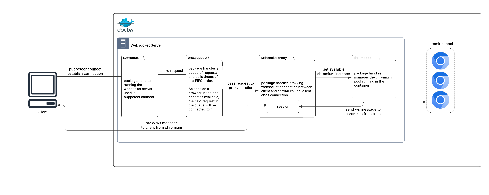

# Reverse Chromium Websocket Proxy

Welcome to **Reverse Chromium WebSocket Proxy**!

This open-source project serves as a scalable reverse WebSocket proxy designed to manage a pool of **Chromium browsers** seamlessly. If you’ve ever worked with **Puppeteer** or any browser automation library and struggled with managing browser instances efficiently, this tool is for you.

Whether you’re building bots, scraping websites, rendering dynamic content, or running headless tests, this service simplifies the entire process by managing browser lifecycles, scaling instances, and facilitating real-time WebSocket communication with clients.

---

## Why Did I Create This?

This project was born out of a desire for an efficient way to manage multiple browser instances in environments without incurring massive resource overhead. Instead of spinning up and managing individual browsers for every task, this tool enables you to:
- decouple **Puppeteer**/**Playwright** usage and browser management
- Reuse browser sessions to save time and resources.
- Vertically scale up or down browsers based on workload automatically.

---

## Who Is This For?

This project is great for developers who:

- Work with **Puppeteer** or browser automation libraries. Especially in serverless workflows where saving startup time and image size really matters. 
- Need an efficient, vertically scalable way to manage browser instances.
- Are building applications where headless browsing, automation, or scraping is necessary.

---

Feel free to explore, use, or contribute to the project! Let me know if you encounter any issues, have feature requests, or simply want to share your thoughts! 😊

## How it Works



Packages not included in the above high-level diagram
1. `chrome`. This packages represents a single Chromium instance running in the container. It has listeners that check for idle events. `NewChrome` handles creating a new browser in the container.
2. `chromeprofile`. Used on startup to unzip a profile for use if specified in the connection query params.
3. `logger`. `zerolog` logger that will include metadata about the browser and session ids in every log. 
4. `metrics`. In memory metrics are used for calculating vertical scaling with chromium instances in `proxyqueue`. Remote metrics are available for use with your own sinks

## How to Use It

See the example `Dockerfile` on how to build it. 

Replace the chromium install with whichever version you need to support.

Once the container is built and is running, simply connect to `ws://localhost:${SERVER_PORT}/connect` with **Puppeteer**/**Playwright**.

An example with **Puppeteer** is included in `scripts/client.mjs`

## Local Development
Install golang [1.21.3](https://go.dev/dl/)

Install node

### Build

To build go chromium-websocket-proxy.exe
```
npm run go:build
```

To build docker image
``` 
npm run docker:build
```

### Testing

For tests run 
```
npm run test
```

For test coverage run
```
npm run test:coverage
```

For testing with a **Puppeteer** client
```
npm run start:client
```

## Environment Variables Documentation

### `MAX_BROWSER_INSTANCES`
- **Default Value**: `10`
- Description: Specifies the maximum number of browser instances that can be created in the pool.

### `MIN_BROWSER_INSTANCES`
- **Default Value**: `0`
- Description: Specifies the minimum number of browser instances to be maintained in the pool. A value of 0 is slower to resolve the first invocation but consumes fewer resources when idle.

### `THROUGHPUT_SCALE_UP_THRESHOLD`
- **Default Value**: `0.6`
- Description: The threshold that triggers the scaling up of browser instances based on throughput performance.

## Chrome-specific Configuration
### `DEFAULT_CHROME_PROFILE`
- **Default Value**: `""` (empty string)
- Description: Specifies the default Chrome profile to be used. This must be a zipped chromium profile placed in `/profiles/*.zip` on your system.

### `ENABLE_AUTO_ASSIGN_DEBUG_PORT`
- **Default Value**: `true`
- Description: Indicates whether debug ports for browsers should be automatically assigned by available ports.

### `CHROME_DEBUG_PORTS`
- **Default Value**: Optional.
- Description: Allows specifying Chrome debug ports for browser instances. Needed if `ENABLE_AUTO_ASSIGN_DEBUG_PORT` is disabled

### `ENABLE_BROWSER_REUSE`
- **Default Value**: `false`
- Description: Determines whether browser instances can be reused between sessions.

### `CHROME_HEADLESS`
- **Default Value**: `true`
- Description: Configures whether Chrome should run in headless mode.

### `CHROME_ENABLE_CUSTOM_PROFILES`
- **Default Value**: `false`
- Description: Indicates whether custom Chrome profiles are enabled.

### `CHROME_ENABLE_BROWSER_AUTO_SHUTDOWN`
- **Default Value**: `true`
- Description: Specifies whether browser instances should automatically shut down when not in use.

### `CHROME_BROWSER_AUTO_SHUTDOWN_TIMEOUT_IN_SECS`
- **Default Value**: `30` seconds
- Description: Timeout for auto-shutting down inactive browser instances.

### `CHROME_BROWSER_AUTO_IDLE_TIMEOUT_IN_SECS`
- **Default Value**: `30` seconds
- Description: Timeout for defining browser instances as idle.

## Logging Configuration
### `LOG_LEVEL`
- **Default Value**: `zerolog.InfoLevel`
- Description: Specifies the logging verbosity level.

### `LOG_OUTPUT`
- **Default Value**: `nil`
- Description: Defines the path of the log output file.

## Server Configuration
### `SERVER_PORT`
- **Default Value**: `3000`
- Description: The port on which the server will be accessible.

### `SERVER_ACCESS_TOKEN`
- **Default Value**: `""` (empty string)
- Description: Access token for securing server endpoints.

### `SERVER_ACCESS_TOKEN_VALIDATION_ENABLED`
- **Default Value**: `false`
- Description: Indicates whether access token validation for server endpoints is enabled.

## Retry Configuration
### `MAX_CREATE_BROWSER_RETRIES`**
- **Default Value**: `20`
- Description: The maximum number of retries when attempting to create a new browser instance.

### `CREATE_BROWSER_RETRY_SLEEP_IN_MS`**
- **Default Value**: `500` ms
- Description: Time in milliseconds to wait between browser creation retries.

## Metrics Configuration
### `STATSITE_SINK`
- **Default Value**: `nil`
- Description: Address of the Statsite metrics sink.

### `STATSD_SINK`
- **Default Value**: `nil`
- Description: Address of the StatsD metrics sink.

### `DATADOG_HOST`
- **Default Value**: `nil`
- Description: Hostname for DataDog integration.

### `DATADOG_ADDRESS`
- **Default Value**: `nil`
- Description: Address for reporting metrics to DataDog.
